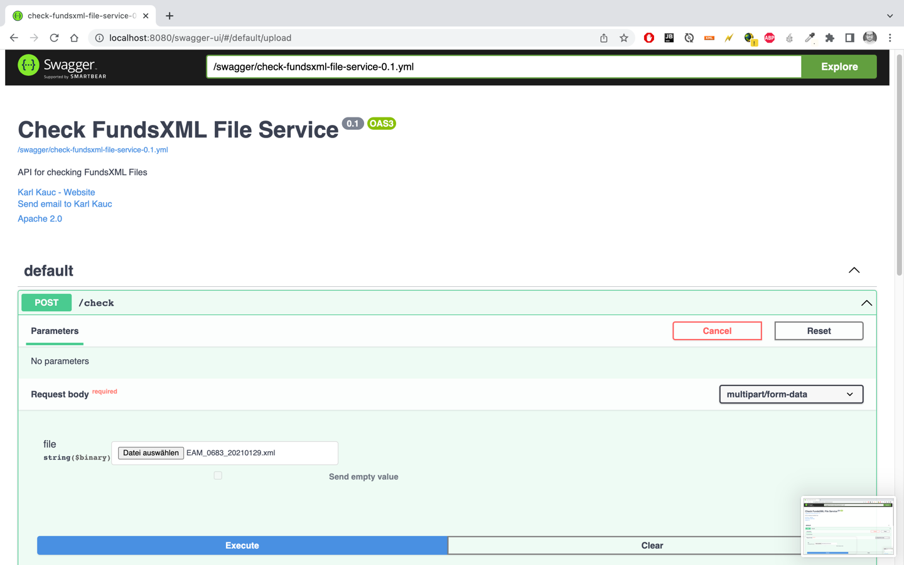

# Check FundsXML Files - API

This project was built for demo purpose of an FundsXML API.

## Requirements

To run this application you need to have Java 17 or higher installed.
Download the latest release and start the application:

    `java -jar CheckFundsXML-0.1-all.jar`

Alternative clone the project and run the application:

`git clone https://github.com/karlkauc/CheckFundsXMLFileAPI.git`

` ./gradlew[.bat|.sh] run`

## Performing checks in the browser

After running the application open a browser: http://localhost:8080/swagger-ui/

## Performing checks on the command line

`
curl -X 'POST'
'http://localhost:8080/check'
-H 'accept: text/plain'
-H 'Content-Type: multipart/form-data'
-F 'file=@FILENAME.xml;type=text/xml'
`

